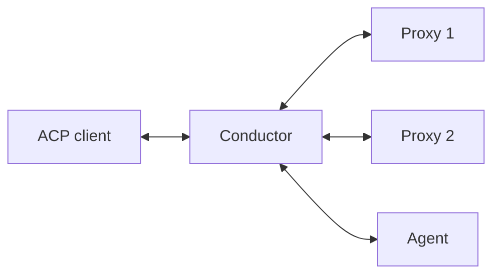

# Conductor Design

The `agent-client-protocol-conductor` crate runs a chain of ACP proxy
components. It presents one ACP endpoint upstream while owning the connections
to every proxy and, in agent mode, the final agent.

For API details, see the
[`agent-client-protocol-conductor` rustdoc](https://docs.rs/agent-client-protocol-conductor).

## Chain Model



Components do not open direct connections to one another. The conductor owns
each transport and maps the logical chain onto those connections:

- Upstream traffic is delivered to the first proxy as ordinary ACP messages.
- A proxy uses `_proxy/successor` to send a request or notification to the next
  component.
- Traffic from a successor is presented to its predecessor through the same
  typed proxy abstraction.
- JSON-RPC responses remain paired with the request context that caused them.

The final agent receives ordinary ACP and does not need to implement the proxy
extension. See the [Proxy Extension Protocol Reference](./protocol.md) for the
wire method shapes.

## Lazy Initialization

Proxy and agent components are instantiated when the first `initialize`
request arrives. For each non-final component, the conductor sends
`_proxy/initialize`; the last component in agent mode receives ordinary
`initialize`. Each proxy can initialize its successor before completing its own
response, so capabilities flow back toward the client through the chain.

Lazy construction allows an `InstantiateProxiesAndAgent` or
`InstantiateProxies` implementation to inspect and, when appropriate, adjust
the initialize request before choosing components.

## Agent and Proxy Modes

In **agent mode**, the conductor owns zero or more proxies followed by a final
agent and acts as an agent toward its upstream client.

In **proxy mode**, the conductor owns only a proxy sub-chain. The final managed
proxy's successor is the conductor's own downstream successor, allowing a
sub-chain to participate as one proxy inside a larger composition.

## Routing and Ordering

A central routing loop serializes forwarding decisions for incoming requests
and notifications. Responses are associated with their original requests by
the core JSON-RPC contexts and may use a direct response path; the conductor
does not maintain a second global request-ID table.

Every physical and in-process bridge carries `TransportFrame`, so tracing and
delegating components preserve JSON-RPC batch boundaries. This matters because
flattening a batch would change one response array into several response
objects. The complete framing rules are documented in [Transport
Architecture](./transport-architecture.md#json-rpc-batch-behavior).

## Command-Line Usage

Global options precede the subcommand. Each component argument is one
shell-parsed command string, so quote commands that include arguments:

```bash
agent-client-protocol-conductor agent \
  "proxy-one --flag" \
  "proxy-two" \
  "base-agent --acp"
```

The last command in `agent` mode is the agent; earlier commands are proxies.
Proxy mode accepts only proxy commands:

```bash
agent-client-protocol-conductor proxy "proxy-one" "proxy-two"
```

Tracing options are global:

```bash
agent-client-protocol-conductor --trace ./trace.jsons agent "proxy-one" "base-agent"
agent-client-protocol-conductor --serve agent "proxy-one" "base-agent"
agent-client-protocol-conductor --trace ./trace.jsons --serve agent "proxy-one" "base-agent"
```

There is no conductor `mcp` subcommand. Compatibility for HTTP-capable agents that lack the
native ACP MCP transport lives in `agent-client-protocol-polyfill` and must
be inserted explicitly when needed.

## Programmatic Usage

```rust,ignore
use agent_client_protocol_conductor::{ConductorImpl, ProxiesAndAgent};

let components = ProxiesAndAgent::new(agent)
    .proxy(first_proxy)
    .proxy(second_proxy);

ConductorImpl::new_agent("conductor", components)
    .run(upstream_transport)
    .await?;
```

`ConductorImpl::new_proxy` accepts an `InstantiateProxies` implementation for
the nested-proxy case. Both modes can use dynamic instantiator closures when
the chain depends on initialization data.

## MCP Compatibility

MCP-over-ACP adaptation is intentionally not built into `ConductorImpl`. Add
`McpOverAcpPolyfill::http()` as a proxy in the chain immediately before a final
agent that cannot consume native `McpServer::Acp` declarations. The
provider-facing side continues to use the feature-gated `mcp/connect`,
`mcp/message`, and `mcp/disconnect` methods; only the final-agent side is
adapted to HTTP. Keeping the polyfill explicit prevents instrumentation or
orchestration from silently changing session MCP declarations. See [MCP
Bridge](./mcp-bridge.md).

## Tracing

The conductor can record an idealized logical sequence of ACP and MCP messages.
Its snooping bridges retain complete transport frames, so enabling tracing does
not change batch behavior. See [Trace Viewer](./trace-viewer.md) for the event
format and current CLI/API examples.
