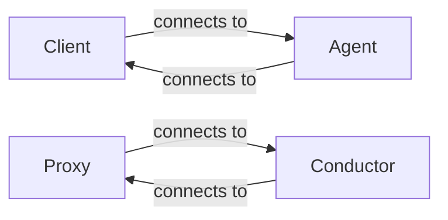
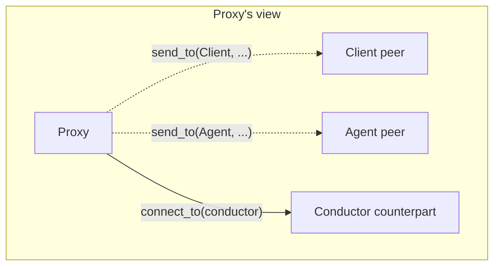
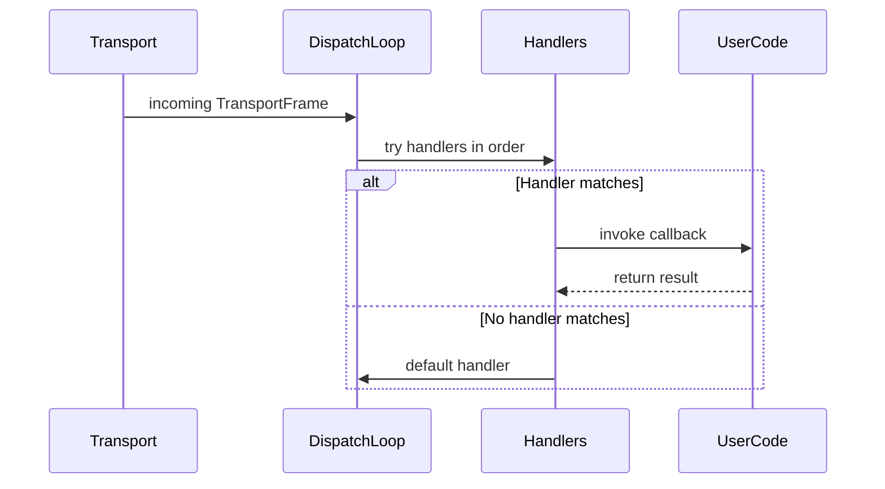
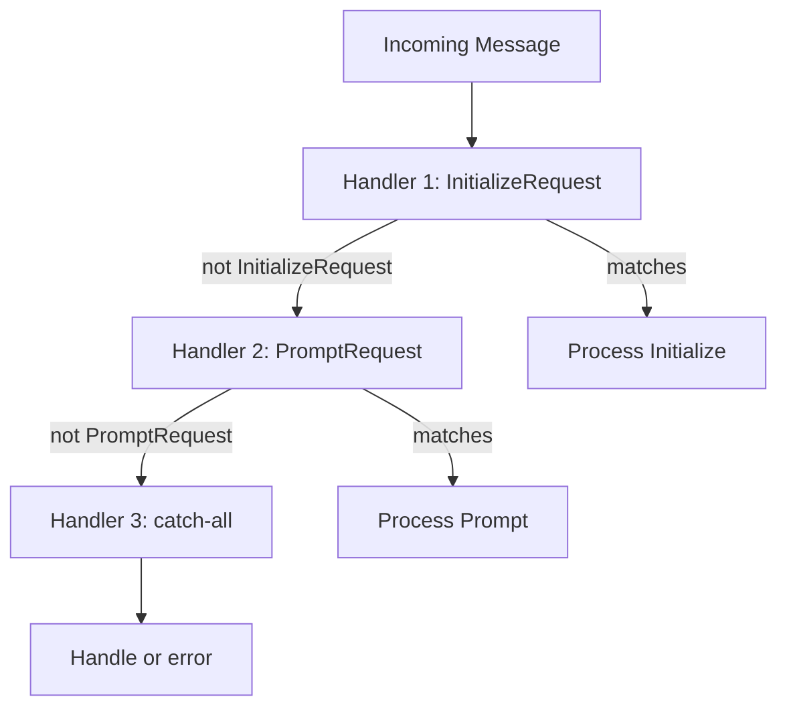
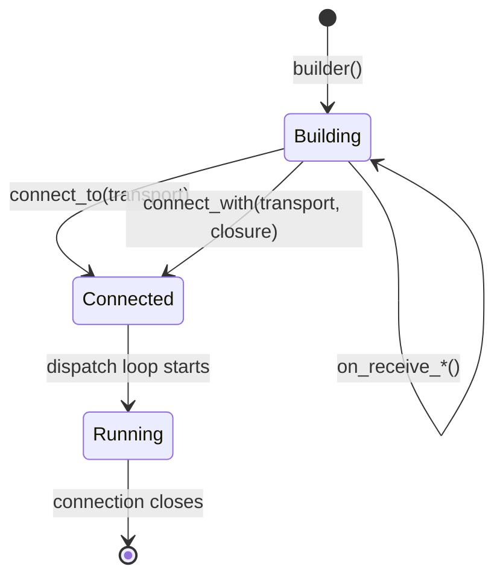

# Core Library Design

This document describes the design of the `agent-client-protocol` crate and its companion transport and integration crates.

For API usage, see the [rustdoc](https://docs.rs/agent-client-protocol) and [cookbook](https://docs.rs/agent-client-protocol-cookbook).

## Crate Organization

### agent-client-protocol

The core SDK. Provides:

- **Role types** (`Client`, `Agent`, `Proxy`, `Conductor`) - the identities in ACP
- **Connection builders** (`builder()`, `connect_to()`, `connect_with()`)
- **Message handling** (`on_receive_request`, `on_receive_notification`, `on_receive_dispatch`)
- **Protocol types** (`agent_client_protocol::schema::*`) - all ACP message types
- **Transports and process launching** (`Channel`, `Lines`, `ByteStreams`, `Stdio`, `AcpAgent`)
- **MCP server attachment** - runtime-agnostic interfaces for wiring MCP servers into ACP sessions

### agent-client-protocol-http

Optional HTTP/SSE and WebSocket clients and servers built on the core transport-frame boundary.

### agent-client-protocol-rmcp

Integration with the [rmcp](https://docs.rs/rmcp) crate:

- **`McpServer::builder()`** - define MCP tools in Rust code
- **`McpServer::from_rmcp()`** - wrap an rmcp server as an ACP MCP server

## Role System

The type system is built around **roles** - the logical identity of an endpoint.

### Counterpart Relationship

Each role has exactly one **counterpart** - who it connects to:

| Role        | Counterpart |
| ----------- | ----------- |
| `Client`    | `Agent`     |
| `Agent`     | `Client`    |
| `Proxy`     | `Conductor` |
| `Conductor` | `Proxy`     |

This is encoded in the type system: `impl ConnectTo<Client> for MyAgent` means "MyAgent can connect to a client" (i.e., MyAgent plays the Agent role).

### Peer Relationship

Some roles can communicate with multiple **peers**. The `Proxy` role is the key example:

- **Counterpart** (Conductor) - who the proxy connects to (transport layer)
- **Peers** (Client, Agent) - who the proxy exchanges logical messages with

## Message Flow

### Dispatch Loop

Each connection runs a dispatch loop that processes incoming messages:

### Handler Chain

Handlers are tried in registration order. The first matching handler wins:

### Ordering Guarantees

The dispatch loop provides sequential processing:

1. Messages are processed one at a time
2. A handler runs to completion before the next message is processed
3. Spawned tasks (`connection.spawn()`) run concurrently with the dispatch loop

**Important**: Don't block the dispatch loop. Use `spawn()` for long-running work.

## Connection Lifecycle

### Two Connection Modes

**Reactive mode** (`connect_to`): The connection runs handlers until the incoming transport reaches clean EOF, drains responses and notifications already accepted by the outgoing queue through the transport sink, then returns `Ok(())`, including when the builder has long-running `with_spawned` work. Used for agents and proxies.

**Active mode** (`connect_with`): Runs a closure with access to the connection, then closes. Used for clients that drive the interaction. Incoming EOF fails requests that still need responses, but it does not automatically cancel unrelated work in the closure.

### Clean Incoming EOF

Incoming EOF is a connection event and a request-liveness boundary:

- Every pending request is completed with an internal error whose data identifies `incoming_transport_closed` and the request method; `is_incoming_transport_closed()` detects it.
- A request created after EOF fails immediately with the same error.
- `ConnectionTo::incoming_closed()` waits for the close event, and `is_incoming_closed()` reports whether it has completed.
- `Builder::on_close()` runs cleanup callbacks in registration order. Returning an error terminates a still-running `connect_with` foreground; returning `Ok(())` leaves its lifetime under application control.

This keeps request correctness separate from async cancellation policy. Applications can finish cleanup or notify a central dispatcher without having an arbitrary foreground future dropped at an await point. Pending requests are failed before close callbacks begin; the close signal is published after callbacks finish, so a callback must not await `incoming_closed()` itself.

## Key Source Files

| File                                         | Purpose                               |
| -------------------------------------------- | ------------------------------------- |
| `src/agent-client-protocol/src/role.rs`      | Role trait and type definitions       |
| `src/agent-client-protocol/src/role/acp.rs`  | Client, Agent, Proxy, Conductor roles |
| `src/agent-client-protocol/src/component.rs` | `ConnectTo` component abstraction     |
| `src/agent-client-protocol/src/jsonrpc.rs`  | Connection builder and frame types    |
| `src/agent-client-protocol/src/jsonrpc/handlers.rs` | Handler chain implementation  |
| `src/agent-client-protocol/src/jsonrpc/transport_actor.rs` | Line framing and JSON parsing |
| `src/agent-client-protocol/src/util/typed.rs` | Dispatch typing and matching helpers |
| `src/agent-client-protocol/src/mcp_server/`  | Runtime-agnostic MCP server attachment |
| `src/agent-client-protocol/src/concepts/`    | Rustdoc concept explanations          |

## Design Decisions

### Why Roles Instead of Links?

Earlier versions used "link types" that encoded both sides (e.g., `ClientToAgent`). Roles are simpler:

- One concept instead of two (role vs link)
- Role types double as peer selectors (`send_to(Agent, ...)`)
- Clearer mental model: "I am X, connecting to Y"

### Why Witness Macros?

The `on_receive_request!()` macros work around Rust's lack of return-type notation. They capture the return type of closures at the call site, enabling type inference to work.

### Why Not Traits for Handlers?

Handler closures are more ergonomic than trait implementations for most use cases. The `HandleDispatchFrom` trait exists for advanced cases (reusable handler components).
