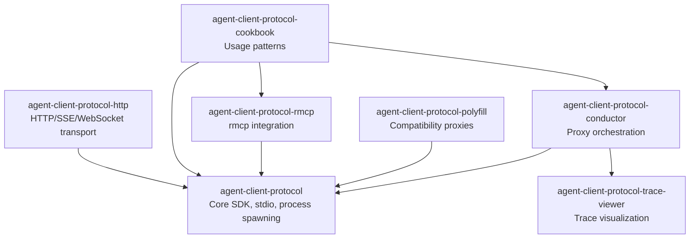

# Agent Client Protocol Rust SDK

This repository contains the Rust SDK for the [Agent-Client Protocol (ACP)](https://agentclientprotocol.com/).

## For Users

**If you want to build something with these crates**, see the rustdoc:

- **[`agent-client-protocol`](https://docs.rs/agent-client-protocol)** - Core SDK for building clients, agents, and proxies
- **[`agent-client-protocol-cookbook`](https://docs.rs/agent-client-protocol-cookbook)** - Practical patterns and examples
- **[`agent-client-protocol-conductor`](https://docs.rs/agent-client-protocol-conductor)** - Running proxy chains

The `agent-client-protocol` crate includes a [`concepts`](https://docs.rs/agent-client-protocol/latest/agent_client_protocol/concepts/) module that explains how connections, sessions, callbacks, and message ordering work.

## For Maintainers and Agents

**This book** documents the design and architecture for people working on the codebase itself.

### Repository Structure

```text
src/
├── agent-client-protocol/              # Core protocol SDK
├── agent-client-protocol-http/         # HTTP/SSE/WebSocket transport
├── agent-client-protocol-rmcp/         # Integration with rmcp crate
├── agent-client-protocol-cookbook/     # Usage patterns (rendered as rustdoc)
├── agent-client-protocol-derive/       # Proc macros
├── agent-client-protocol-conductor/    # Conductor binary and library
├── agent-client-protocol-polyfill/     # Compatibility proxy implementations
├── agent-client-protocol-test/         # Test utilities and fixtures
├── agent-client-protocol-trace-viewer/ # Trace visualization tool
└── yopo/                               # "You Only Prompt Once" example client
```

### Crate Relationships



### Key Design Documents

- [Core Library Design](./design.md) - How the core crate and its transport and integration crates are organized
- [Transport Architecture](./transport-architecture.md) - The frame-aware boundary shared by transports and in-process components
- [Conductor Design](./conductor.md) - How the conductor orchestrates proxy chains
- [Protocol Reference](./protocol.md) - Wire protocol details and extension methods
- [Original P/ACP Design Proposal](./proxying-acp.md) - Historical design context; not the current wire reference
- [Migrating to v2.0](./migration_v2.0.md) - Upgrade guide from 1.x to 2.0
- [Migrating to v0.11](./migration_v0.11.x.md) - Upgrade guide from 0.10.x to 0.11
